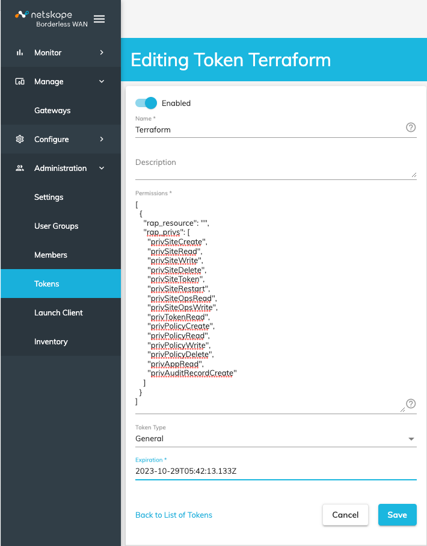

# Netskope SD-WAN GW Azure Module

This Infrastructure as Code (IaC) will help you deploy Netskope SD-WAN Gateway in your Azure environment in following scenarios:
- Deploy and activate Netskope SD-WAN Gateway in a new Virtual network and connect to a new Route Server
- Deploy and activate Netskope SD-WAN Gateway in an existing Virtual network and connect to existing Route Server
- Deploy Gateway with multiple WAN links / interfaces
- Optional client deployment for end to end solution validation

This module creates / configures the following objects in Azure and Netskop SD-WAN Portal:

## Azure Cloud
   - Virtual Network (Re-use existing or create new one)
   - Subnets (Re-use existing or create new one)
   - Route Server (Re-use existing or create new one)
   - Network Security Groups (For both WAN network and Private network)
   - BGP Peering in Route Server to Netskope SD-WAN
   - Route tables for WAN network and Private network
   - Host Vnet / VM and required peerings (if chosen)

## Netskope SD-WAN Portal
   - Create new policy
   - Create new gateway (HA deployment is optional)
   - Configure required static routes and BGP peers

## Key Points

- The default username for the gateway is "infiot". Password authentication is disabled and you must use SSH keys to authenticate.
  This module has an option to set the password for the default username "infiot". This will be used only for console access.

## Architecture Diagram

This IaC will create the Azure resources as shown below.


*Fig 1. Netskope SD-WAN GW deployment in Azure*

## Deployment

To deploy this template in Azure:

- First, get authenticated to Azure Cloud using `az login` and `az account set --subscription <name>`

- Identify the "Base URL" for your Netskope SD-WAN Tenant. This is a URL that you use to access your Netskope tenant, for example: `https://example.infiot.net`
  This will be set in "netskope_tenant" variable blob

- Get the ID of your Tenant from Netskope Team.

- Create a REST API Token as follows:



*Fig 2. Netskope SD-WAN Portal API Token*

- Clone the GitHub repository for this deployment.

- Configure provider block or set variables in the "provider.tf" file.

- Customize variables in the `example.tfvars` and `variables.tf` file as needed.
- Change to the repository directory and then initialize the providers and modules.

   ```sh
   $ cd <Code Directory>
   $ terraform init
    ```
- Submit the Terraform plan to preview the changes Terraform will make to match your configuration.

   ```sh
   $ terraform plan
   ```
- Apply the plan. The apply will make no changes to your resources, you can either respond to the confirmation prompt with a 'Yes' or cancel the apply if changes are needed.

   ```sh
   $ terraform apply
   ```

## Destruction

- To destroy this deployment, use the command:

   ```sh
   $ terraform destroy
   ```

## Support

Netskope-provided scripts in this and other GitHub projects do not fall under the regular Netskope technical support scope and are not supported by Netskope support services.